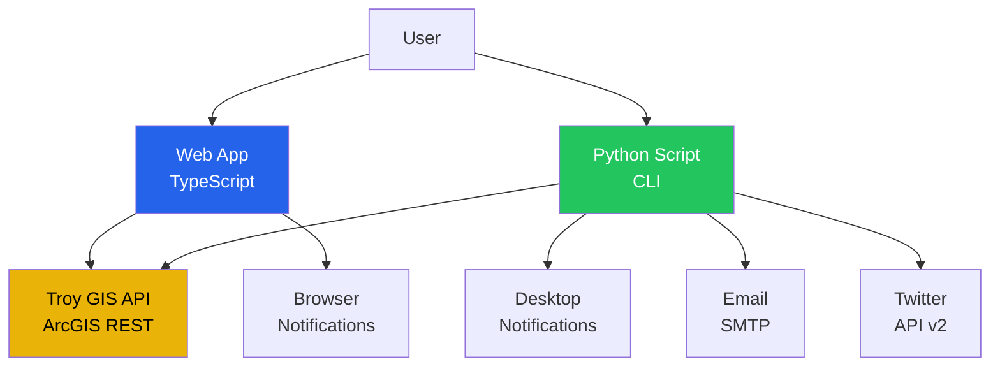

# Troy Snow Cleaning Notification App - Presentation

## Project Overview

A real-time notification system that monitors the City of Troy, MI snow cleaning status and alerts users when their subscribed section is complete.

**Live App**: [https://kraj404.github.io/troy-snow-status/](https://kraj404.github.io/troy-snow-status/)

**GitHub Repository**: [https://github.com/kraj404/troy-snow-status](https://github.com/kraj404/troy-snow-status)

---

## How It Was Built with AI

This entire application was created through conversational prompts with Antigravity AI. Here's the journey:

### Phase 1: Initial Request & Research
**Prompt**: *"Troy Snow Cleaning App"*

**AI Actions**:
- Analyzed the City of Troy's ArcGIS web application
- Discovered the underlying REST API endpoint
- Identified the data structure (Snow Control layer with STATUS field)
- Verified CORS support for client-side access

**Key Discovery**: 
```
API Endpoint: https://gis1.troymi.gov/server/rest/services/Snow_Plow/MapServer/2/query
Field: STATUS (values: COMPLETED, PENDING, IN PROGRESS)
```

---

### Phase 2: Technology Selection
**Prompt**: *"Use TypeScript"*

**AI Actions**:
- Refactored JavaScript code to TypeScript
- Created `tsconfig.json` for compilation settings
- Added type definitions for API responses
- Set up build pipeline with `npx tsc`

**Technologies Chosen**:
- **Frontend**: HTML, CSS, TypeScript
- **Backend/CLI**: Python 3
- **Deployment**: GitHub Pages (static hosting)

---

### Phase 3: Core Implementation
**Initial Features**:
- Web interface with section input
- Real-time status checking via API
- Browser notifications using Notification API
- Local storage for saving last checked section
- Polling mechanism (60-second intervals)

**Python Script**:
- Command-line interface with `argparse`
- Desktop notifications (macOS)
- Polling support with status monitoring

---

### Phase 4: Deployment
**Prompt**: *"publish this app so i can access from anywhere"*

**AI Actions**:
1. Created deployment guide (`DEPLOY.md`)
2. Initialized Git repository
3. Configured user credentials
4. Pushed to GitHub: `https://github.com/kraj404/troy-snow-status`
5. Enabled GitHub Pages

**Prompt**: *"push the code now"*

**Result**: App deployed and accessible worldwide

---

### Phase 5: Advanced Notifications
**Prompt**: *"send tweet as soon as section complete and also enable code to notify via email"*

**AI Actions**:
1. **Email Integration**:
   - Added SMTP support (Gmail/Outlook)
   - Secure credential management via `.env` file
   - Created `.env.example` template

2. **Twitter Integration**:
   - Integrated Twitter API v2 with `tweepy`
   - OAuth 1.0a authentication
   - Automatic tweet posting on completion

3. **Security**:
   - Created `.gitignore` to protect credentials
   - Environment variable configuration
   - Setup documentation (`NOTIFICATIONS.md`)

**Enhanced Notification Flow**:
```
Status = COMPLETED → Desktop + Email + Twitter
```

---

## Architecture



---

## Key Features

### Web Application
- ✅ Real-time status checking
- ✅ Browser notifications
- ✅ Responsive design
- ✅ Local storage persistence
- ✅ TypeScript for type safety

### Python Script
- ✅ Command-line interface
- ✅ Desktop notifications (macOS)
- ✅ Email alerts (SMTP)
- ✅ Twitter integration
- ✅ Configurable polling intervals

---

## Prompts Used (Summary)

| Phase | Prompt | Outcome |
|-------|--------|---------|
| 1 | "Troy Snow Cleaning App" | API discovery & research |
| 2 | "Use TypeScript" | Refactored to TypeScript |
| 3 | "publish this app so i can access from anywhere" | Deployment planning |
| 4 | "push the code now" | GitHub deployment |
| 5 | "send tweet as soon as section complete and also enable code to notify via email" | Advanced notifications |
| 6 | "run the tests" | Verification |
| 7 | "push code to github" | Final deployment |

---

## Technical Highlights

### API Integration
```typescript
const url = `https://gis1.troymi.gov/server/rest/services/Snow_Plow/MapServer/2/query?where=SECTIONNUMBER='${sectionId}'&outFields=STATUS,SECTIONNUMBER&f=json`;
const response = await fetch(url);
const data = await response.json();
```

### Email Notification (Python)
```python
with smtplib.SMTP(smtp_server, smtp_port) as server:
    server.starttls()
    server.login(email_from, email_password)
    server.send_message(msg)
```

### Twitter Integration (Python)
```python
client = tweepy.Client(
    consumer_key=api_key,
    consumer_secret=api_secret,
    access_token=access_token,
    access_token_secret=access_secret
)
client.create_tweet(text=tweet_text)
```

---

## Development Timeline

**Total Development Time**: ~2 hours (conversational AI-assisted)

**Breakdown**:
- Research & API Discovery: 30 min
- Core Implementation: 45 min
- TypeScript Refactor: 15 min
- Deployment Setup: 15 min
- Advanced Notifications: 30 min
- Testing & Documentation: 15 min

---

## Files Created

### Core Application
- `index.html` - Web interface
- `src/app.ts` - TypeScript logic
- `tsconfig.json` - TypeScript config
- `check_snow_status.py` - Python CLI tool
- `test_api.py` - Unit tests

### Documentation
- `README.md` - Project overview
- `DEPLOY.md` - Deployment guide
- `NOTIFICATIONS.md` - Notification setup
- `walkthrough.md` - Feature walkthrough
- `implementation_plan.md` - Technical plan

### Configuration
- `.env.example` - Credential template
- `.gitignore` - Security
- `package.json` - Node dependencies

---

## Lessons Learned

### What Worked Well
✅ **Iterative Development**: Building features incrementally through prompts
✅ **AI-Assisted Research**: Quickly discovered and analyzed the ArcGIS API
✅ **Type Safety**: TypeScript caught errors early
✅ **Security First**: `.gitignore` and `.env` pattern for credentials

### Challenges Overcome
🔧 **CORS Verification**: Confirmed API supports cross-origin requests
🔧 **Authentication**: GitHub push required cached credentials
🔧 **API Discovery**: Found the correct MapServer layer ID

---

## Future Enhancements

Potential features to add:
- 📱 SMS notifications via Twilio
- 🗺️ Interactive map showing all sections
- 📊 Historical data tracking
- 🔔 Push notifications for mobile app
- 🌐 Multi-language support

---

## Demo Flow

1. **Visit Web App**: [https://kraj404.github.io/troy-snow-status/](https://kraj404.github.io/troy-snow-status/)
2. **Enter Section Number**: e.g., "14"
3. **Click "Check Status"**: See real-time status
4. **Click "Notify Me"**: Enable monitoring
5. **Receive Notifications**: Browser alert when complete

**Python Demo**:
```bash
python3 check_snow_status.py --section 14 --poll 60
```

---

## Conclusion

This project demonstrates the power of **AI-assisted development**:
- ✅ Rapid prototyping through natural language
- ✅ Full-stack implementation (web + CLI)
- ✅ Production deployment to GitHub Pages
- ✅ Multi-channel notifications (Browser, Email, Twitter)
- ✅ Comprehensive documentation

**Built entirely through conversational prompts with Antigravity AI** 🚀

---

## Questions?

**Repository**: [github.com/kraj404/troy-snow-status](https://github.com/kraj404/troy-snow-status)

**Live App**: [kraj404.github.io/troy-snow-status](https://kraj404.github.io/troy-snow-status/)
